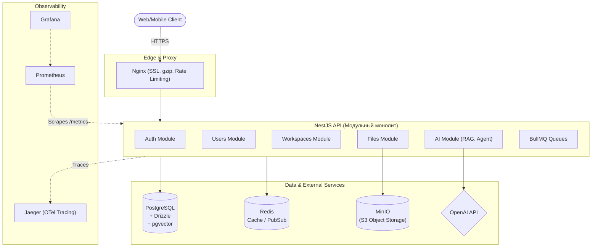

# Backend Roadmap v2: Omnia Edition
## Omnia Edition — Refactored

**10 месяцев · 40 недель + 2 буферных · от Frontend до Backend Middle**

| | |
|---|---|
| **Стек** | TypeScript · NestJS · PostgreSQL · Drizzle · Redis · BullMQ · Docker · OpenAI/pgvector |
| **Проект** | Omnia — AI-native SaaS агент-платформа |
| **Цель** | Backend Middle / Fullstack — международный рынок |
| **Бюджет** | 25–30 часов/неделю |
| **Акцент** | 30% SQL · 25% NestJS · 15% Docker · 10% AI/LLM · 10% Redis/BullMQ · 5% Security · 5% Testing |

### Что НЕ УЧИТЬ (расфокус на этом этапе)
- **Kubernetes вглубь** — знать, что есть; руками не трогать
- **Kafka** — BullMQ закроет все потребности
- **Микросервисы с нуля** — модульный монолит — правильный выбор
- **Второй backend-язык (Go/Rust)** — отнимет время от базы
- **DDD / Clean Architecture как догма** — паттерны придут с опытом

### Отличия от v1

- **10 месяцев** вместо 12 — тот же объём, выше темп (25–30 ч/нед позволяет)
- **Параллельные треки** SQL + NestJS/Drizzle с месяца 2 (вместо 8 недель чистого SQL)
- **Drizzle с 7-й недели** вместо 17-й — typesafe запросы с первого дня NestJS
- **Pino с месяца 2** — structured logging как привычка, не финальный штрих
- **AI/LLM модуль** — 4 полных недели: SDK, RAG, pgvector, agent patterns
- **File Uploads / S3** — неделя на Multer, MinIO, presigned URLs
- **Security сжат** с 4 до 2 недель — фокус на том, что реально встретится
- **2 буферных недели** — после месяца 4 и месяца 7

---

## Месяц 1: HTTP, Node.js, Express, Auth
> [!NOTE]
> Фундамент сервера: как браузер говорит с бэкендом

---

### Неделя 1 · HTTP & сети

#### Теория

- [ ] **HTTP: Request / Response / Headers / Status Codes**
Что значит 200, 201, 400, 401, 403, 404, 500 — и когда что возвращать

- [ ] **HTTP-методы: GET / POST / PUT / PATCH / DELETE**
Семантика идемпотентности. Разница PUT vs PATCH на реальных примерах

- [ ] **URL, Path Params, Query Params**
`/users/:id` vs `/users?role=admin` — когда что использовать

- [ ] **DNS, IP, TCP — путь запроса**
Понять на уровне схемы: DNS resolve → TCP connect → HTTP request → response

- [ ] **HTTPS, TLS, сертификаты**
Что такое handshake, почему HTTP в 2026 — моветон

#### Практика

- [ ] Postman: сделать 20 запросов на JSONPlaceholder, httpbin.org, reqres.in
- [ ] Записать в Postman коллекцию: каждый метод с примером header и body
- [ ] Через браузер DevTools изучить реальный TLS-сертификат любого сайта
- [ ] Нарисовать на бумаге путь запроса от браузера до сервера

> [!IMPORTANT]
> **Deliverable недели**
> Postman-коллекция (20+ запросов) + схема пути запроса от браузера до сервера

---

### Неделя 2 · Node.js — движок под капотом

#### Теория

- [ ] **Event Loop: фазы и порядок выполнения**
timers → I/O callbacks → idle → poll → check → close. Почему Node не блокируется

- [ ] **Call Stack, Heap, Task Queue, Microtask Queue**
Разница между `setTimeout(fn,0)` и `Promise.resolve().then(fn)`

- [ ] **Async/Await, Promise, callback hell**
Почему async/await — это синтаксический сахар над Promise. Обработка ошибок

- [ ] **Streams и Buffers**
Зачем нужны стримы при работе с большими файлами. Readable/Writable/Transform

- [ ] **File System (fs), Path, OS модули**
`readFile` vs `createReadStream` — когда что. Работа с путями кросс-платформенно

#### Практика

- [ ] Написать сервер на чистом Node http без фреймворков: роутинг через if/switch
- [ ] Реализовать чтение большого файла через поток и через readFile — измерить память
- [ ] Написать промис-цепочку и переписать её в async/await. Обработать все ошибки
- [ ] Создать простой CLI-скрипт, который читает .json файл и выводит данные

> [!IMPORTANT]
> **Deliverable недели**
> Сервер на чистом Node: GET /users, POST /users, GET /users/:id — без Express

---

### Неделя 3 · Express — структура и middleware (ускоренная)

> [!NOTE]
> Express изучается как фундамент для понимания NestJS middleware, а не как самостоятельный фреймворк. Темп: 3–4 дня вместо полной недели.

#### Теория

- [ ] **Middleware: что это и как работает цепочка**
req → middleware1 → middleware2 → handler → res. `next()` и когда его не вызывать

- [ ] **Routing: Router, параметры, вложенные роуты**
`express.Router()`, `app.use('/api/v1', router)`. Разбивка по модулям

- [ ] **Error Handling Middleware**
Сигнатура `(err, req, res, next)`. Централизованная обработка ошибок

- [ ] **Validation с zod**
Никогда не доверять входным данным. Схемы валидации как первая линия защиты

- [ ] **Environment variables (.env)**
dotenv, никогда не коммитить секреты, `process.env` — паттерны доступа

#### Практика

- [ ] Переписать Node-сервер из недели 2 на Express
- [ ] Добавить middleware: логирование каждого запроса (метод, путь, время)
- [ ] Добавить zod-валидацию на POST /users (name: string, email: string)
- [ ] Написать централизованный error handler: `{error, message, statusCode}`
- [ ] Установить PostgreSQL локально, создать базу `omnia_dev`. Подключиться через `psql` — убедиться что всё работает (подготовка к месяцу 2)

> [!IMPORTANT]
> **Deliverable недели**
> Express CRUD API для /users: GET list, GET :id, POST, PUT, DELETE — с валидацией и error handling. PostgreSQL установлен и доступен

---

### Неделя 4 · Auth: JWT, Cookies, Sessions

#### Теория

- [ ] **Cookies vs Sessions vs JWT**
Stateful (session в Redis/DB) vs Stateless (JWT). Трейдоффы в масштабировании

- [ ] **JWT: структура header.payload.signature**
Что подписывается, что шифруется (ничего по умолчанию), почему нельзя хранить пароль

- [ ] **Access Token + Refresh Token паттерн**
Короткий access (15min), длинный refresh (7d). Rotation стратегия

- [ ] **bcrypt: хеширование паролей**
Salt rounds, почему нельзя MD5/SHA1, timing attacks

- [ ] **httpOnly Cookie для refresh token**
XSS не может достать httpOnly. Почему access token в памяти, а не localStorage

#### Практика

- [ ] POST /auth/register: bcrypt hash пароля, сохранить в **PostgreSQL** (не in-memory!)
- [ ] POST /auth/login: проверить bcrypt, выдать access JWT + refresh в httpOnly cookie
- [ ] Middleware authGuard: проверять `Authorization: Bearer <token>`
- [ ] POST /auth/refresh: читать refresh из cookie, выдавать новый access token
- [ ] POST /auth/logout: удалять refresh cookie
- [ ] Написать 3 базовых теста на auth flow (Jest): register success, login wrong password, protected route without token

> [!IMPORTANT]
> **Deliverable недели**
> Полный auth flow: register → login → protected route → refresh → logout. Данные в PostgreSQL. 3 теста. Всё через Postman с демонстрацией

---

<b>Вопросы с собеседований (Месяц 1)</b> <i>(нажми чтобы развернуть)</i>

- Q: Что такое idempotency и какие HTTP-методы идемпотентны?
- Q: Объясни Event Loop в Node.js. Разница между microtask и macrotask queue.
- Q: Чем отличается JWT от Session-based auth? Когда использовать что?
- Q: Зачем нужен Refresh Token? Как реализовать rotation?
- Q: Что такое middleware в Express? Напиши error handler middleware.

---

## Месяц 2: SQL Basics + NestJS Skeleton + Drizzle
> [!NOTE]
> Два параллельных трека: SQL-фундамент + первый typesafe код на NestJS

---

### Неделя 5 · DDL, DML, базовые запросы

#### Теория

- [ ] **CREATE TABLE: типы данных PostgreSQL**
integer, bigint, varchar, text, boolean, uuid, timestamptz, jsonb — когда что. PRIMARY KEY, NOT NULL, UNIQUE. **`numeric` для денег (НЕ float)**.

- [ ] **INSERT, UPDATE, DELETE, RETURNING**
`RETURNING *` — незаменим при работе с ORM. Batch INSERT. UPDATE с условием

- [ ] **SELECT: WHERE, ORDER BY, LIMIT, OFFSET**
Pagination через OFFSET vs cursor-based. Почему OFFSET медленный на больших таблицах

- [ ] **Constraints: FK, CHECK, UNIQUE**
ON DELETE CASCADE vs RESTRICT vs SET NULL. Почему FK — не просто красота

- [ ] **Нормализация: 1NF, 2NF, 3NF**
Практическое понимание: что в отдельную таблицу, что можно денормализовать

#### Практика

- [ ] Создать схему Omnia: `users (id uuid, email, password_hash, created_at, updated_at)`
- [ ] Создать `workspaces (id uuid, name, slug, owner_id FK → users)`
- [ ] INSERT 10 пользователей, 3 воркспейса, UPDATE email одного, DELETE одного с проверкой CASCADE
- [ ] Написать 10 SELECT запросов разной сложности с WHERE, ORDER BY, LIMIT

> [!IMPORTANT]
> **Deliverable недели**
> Omnia schema v1: таблицы users + workspaces с FK, constraints, seed-данными (10 users, 5 workspaces)

---

### Неделя 6 · JOIN, агрегация, CTE, Window Functions

> [!NOTE]
> Объединено из недель 6–7 оригинального плана. При 25–30 ч/нед материал двух недель усваивается за одну интенсивную неделю.

#### Теория

- [ ] **INNER JOIN, LEFT JOIN, RIGHT JOIN, FULL OUTER JOIN**
Визуальная диаграмма Венна. INNER — только совпадения. LEFT — все левые + совпадения справа

- [ ] **Многие-ко-многим: junction table**
`workspace_members(workspace_id, user_id, role)` — паттерн для Omnia memberships

- [ ] **GROUP BY, HAVING, агрегатные функции**
COUNT, SUM, AVG, MIN, MAX. Разница WHERE vs HAVING. GROUP BY с несколькими полями

- [ ] **CTE (WITH clause)**
Читаемость сложных запросов. Рекурсивные CTE для иерархий. Materialized vs inline

- [ ] **Window Functions: ROW_NUMBER, RANK, LAG, LEAD**
`OVER(PARTITION BY ... ORDER BY ...)`. Нумерация строк внутри группы — частый кейс

- [ ] **DISTINCT ON**
Специфика PostgreSQL. Получить последнюю запись по группе без subquery

#### Практика

- [ ] Создать таблицу `workspace_members(workspace_id, user_id, role, joined_at)`
- [ ] JOIN: получить всех участников воркспейса с именами и email
- [ ] LEFT JOIN: найти пользователей без ни одного воркспейса (IS NULL паттерн)
- [ ] COUNT + GROUP BY + HAVING: воркспейсы с > 2 участниками
- [ ] CTE: сначала получить активных юзеров, потом их воркспейсы
- [ ] Window Function: ROW_NUMBER() для нумерации участников по дате вступления
- [ ] DISTINCT ON: получить последний вход каждого пользователя

> [!IMPORTANT]
> **Deliverable недели**
> 10 сложных запросов для Omnia: JOIN, CTE, Window Functions. Таблица workspace_members. Все запросы задокументированы с комментариями

---

### Неделя 7 · NestJS Skeleton + Drizzle Setup + Pino

> [!NOTE]
> Переключение контекста: от чистого SQL к коду. Студент применяет SQL-знания через typesafe ORM с первого дня.

#### Теория

- [ ] **Архитектура NestJS: модульная система**
`@Module(imports, controllers, providers, exports)`. Корневой AppModule и feature modules

- [ ] **Controllers: роутинг и декораторы**
@Get, @Post, @Param, @Body, @Query, @Headers. Контроллер только маршрутизирует

- [ ] **Providers (Services): бизнес-логика**
`@Injectable()`. Сервис — единственное место где живёт логика

- [ ] **Drizzle: schema-first подход**
`pgTable`, колонки, типы. `uuid('id').primaryKey().defaultRandom()`. Drizzle Kit для миграций

- [ ] **Pino: structured logging с первого дня**
`nestjs-pino`: JSON логи, requestId, redaction. Заменяет `console.log` навсегда

#### Практика

- [ ] `nest new omnia-backend` — создать проект
- [ ] Переписать SQL-схему Omnia на Drizzle: users, workspaces, workspace_members
- [ ] `drizzle-kit generate` → `drizzle-kit migrate` — первая миграция
- [ ] UsersModule: CRUD через Drizzle typed queries (не raw SQL)
- [ ] Подключить `nestjs-pino`: JSON логи с requestId на каждый запрос
- [ ] `pino-pretty` для dev, plain JSON для Docker

> [!IMPORTANT]
> **Deliverable недели**
> NestJS Omnia skeleton: UsersModule + WorkspacesModule с Drizzle CRUD. Структурированные логи Pino. Первая миграция применена

---

### Неделя 8 · Индексы, EXPLAIN — через призму NestJS

> [!NOTE]
> SQL-оптимизация на реальных запросах из приложения. Студент видит EXPLAIN на тех запросах, которые генерирует Drizzle.

#### Теория

- [ ] **B-Tree индекс: как работает**
Структура дерева. Sequential scan vs Index scan. Когда индекс не помогает (low cardinality, small table)

- [ ] **Composite Index: порядок полей**
`(a, b)` индекс работает для `WHERE a=...` и `WHERE a=... AND b=...`, но НЕ для `WHERE b=...`

- [ ] **Partial Index**
`CREATE INDEX ON users(email) WHERE deleted_at IS NULL` — экономия места и скорость

- [ ] **EXPLAIN и EXPLAIN ANALYZE**
Seq Scan vs Index Scan vs Bitmap Heap Scan. Rows, cost, actual time. Как читать план

- [ ] **N+1 проблема**
SELECT users потом SELECT workspace FOR EACH user = катастрофа. JOIN или DataLoader

#### Практика

- [ ] EXPLAIN ANALYZE на 3 запросах из Drizzle — найти Seq Scan и убрать его индексом
- [ ] Включить логирование SQL в Drizzle (`logger: true`) — видеть реальные запросы
- [ ] Создать partial index на `workspace_members WHERE role = 'owner'`
- [ ] Создать composite index на `(workspace_id, user_id)` для memberships
- [ ] Сгенерировать 10 000 строк тестовых данных, сравнить время до/после индекса

> [!IMPORTANT]
> **Deliverable недели**
> Отчёт: 3 запроса до и после оптимизации с EXPLAIN ANALYZE output + список всех индексов Omnia с обоснованием

---

<b>Вопросы с собеседований (Месяц 2)</b> <i>(нажми чтобы развернуть)</i>

- Q: Объясни разницу INNER JOIN vs LEFT JOIN на примере users и workspaces.
- Q: Что такое N+1 проблема? Как обнаружить и исправить?
- Q: Чем Drizzle отличается от Prisma? Когда выбрать Drizzle?
- Q: Когда индекс не помогает? Что такое low cardinality?
- Q: Что такое structured logging? Зачем JSON логи вместо plain text?

---

## Месяц 3: SQL Advanced + NestJS Architecture
> [!NOTE]
> Транзакции и конкурентность изучаются в контексте реального NestJS-кода — не в абстрактном psql

---

### Неделя 9 · NestJS: DI, Pipes, Guards, Interceptors

#### Теория

- [ ] **DI Container: что это и зачем**
IoC принцип. NestJS сам создаёт и управляет экземплярами. Не `new Service()`, а инъекция

- [ ] **Scopes: DEFAULT, REQUEST, TRANSIENT**
Синглтон по умолчанию. REQUEST scope — новый экземпляр на каждый запрос (осторожно с памятью)

- [ ] **Custom Providers: useValue, useFactory, useClass**
useFactory для асинхронной инициализации. useValue для конфигов и моков

- [ ] **Pipes: трансформация и валидация**
ValidationPipe с class-validator. ParseUUIDPipe. Глобальный vs локальный pipe

- [ ] **Guards: авторизация запросов**
`canActivate()`. JwtAuthGuard, RolesGuard. Порядок выполнения

- [ ] **Interceptors: cross-cutting concerns**
Логирование, трансформация ответа, кэширование. Execution context

- [ ] **Exception Filters**
Централизованная обработка ошибок. HttpException, кастомные исключения. @Catch()

#### Практика

- [ ] ConfigModule с useFactory, читающий .env через `@nestjs/config`
- [ ] DrizzleModule с useFactory: создать connection, вернуть как провайдер
- [ ] Глобальный ValidationPipe: DTO для CreateUserDto с @IsEmail, @MinLength(8)
- [ ] LoggingInterceptor: логировать метод, путь, время выполнения (через Pino)
- [ ] HttpExceptionFilter: возвращать единый формат `{statusCode, message, timestamp, path}`
- [ ] Написать unit тест для UsersService с mock провайдером

> [!IMPORTANT]
> **Deliverable недели**
> Omnia API с полным слоем Guards + Validation + Interceptors. Все ошибки имеют единый формат. ConfigModule валидирует env

---

### Неделя 10 · Транзакции, ACID — через Drizzle

> [!NOTE]
> Транзакции изучаются не абстрактно в psql, а через `db.transaction()` в реальном NestJS-сервисе. Ошибки видны в Pino-логах.

#### Теория

- [ ] **ACID: Atomicity, Consistency, Isolation, Durability**
Атомарность: всё или ничего. Как PostgreSQL гарантирует C, I, D на уровне WAL

- [ ] **BEGIN / COMMIT / ROLLBACK**
Явные транзакции. Savepoints. Вложенные транзакции (SAVEPOINT + ROLLBACK TO)

- [ ] **WAL (Write-Ahead Log)**
Почему БД не теряет данные при краше. Checkpoint. pg_wal директория

- [ ] **Транзакции в Drizzle**
`db.transaction(async (tx) => { ... })` — передавать tx вместо db в nested операции

- [ ] **Conflict handling: onConflictDoNothing, onConflictDoUpdate**
Upsert паттерн — критичен для workspace_members при повторном инвайте

#### Практика

- [ ] Транзакция в Drizzle: `createWorkspace` → `addOwnerAsMember` атомарно
- [ ] Симулировать ошибку в середине транзакции — убедиться что ROLLBACK работает (видно в Pino-логах)
- [ ] SAVEPOINT: часть операций отменить, часть закоммитить
- [ ] Upsert в workspace_members: если уже существует — обновить роль, иначе создать
- [ ] Prepared statement для getUserByEmail — высокочастотный запрос при auth

> [!IMPORTANT]
> **Deliverable недели**
> Транзакционные сценарии Omnia в Drizzle: создание воркспейса, инвайт пользователя — все атомарны. Upsert для memberships

---

### Неделя 11 · MVCC, Locks, Isolation Levels

> [!NOTE]
> Конкурентность изучается в двух форматах: сначала в psql (для понимания), потом воспроизводится в NestJS (для закрепления).

#### Теория

- [ ] **MVCC: Multi-Version Concurrency Control**
PostgreSQL не блокирует читателей писателями. Версии строк (xmin/xmax), snapshot isolation

- [ ] **Row-level locks: SELECT FOR UPDATE / FOR SHARE**
Pessimistic locking. Когда нужно явно залочить строку перед UPDATE. **Optimistic locking** через version-столбец.

- [ ] **Deadlock: как возникает и как PostgreSQL его решает**
Circular lock dependency. PostgreSQL автоматически убивает одну транзакцию. Как предотвратить

- [ ] **4 уровня изоляции: READ COMMITTED, REPEATABLE READ, SERIALIZABLE**
PostgreSQL использует RC по умолчанию. Аномалии: dirty read, non-repeatable read, phantom read

- [ ] **SERIALIZABLE в PostgreSQL: SSI**
Serializable Snapshot Isolation — optimistic concurrency. Когда использовать

#### Практика

- [ ] В psql: два конкурентных UPDATE одной строки — увидеть поведение PostgreSQL
- [ ] В psql: создать deadlock намеренно из двух сессий — увидеть ERROR
- [ ] В psql: воспроизвести Non-Repeatable Read на READ COMMITTED, защититься REPEATABLE READ
- [ ] **В NestJS**: написать endpoint `/workspaces/:id/join` с SELECT FOR UPDATE — симулировать два одновременных вступления в workspace с лимитом мест
- [ ] **В NestJS**: поймать `SerializationFailure` в Pino-логах, обработать через retry

> [!IMPORTANT]
> **Deliverable недели**
> Шпаргалка: isolation levels × аномалии + 2 реальных кейса Omnia (в psql + в NestJS коде) с выбранным уровнем и обоснованием

---

### Неделя 12 · NestJS Auth Module + JSONB + Full-text Search

#### Теория

- [ ] **Passport.js в NestJS: @nestjs/passport**
Strategy паттерн. JwtStrategy, LocalStrategy. PassportModule.register()

- [ ] **JwtModule: signing и verification**
JwtModule.registerAsync() с ConfigService. HS256 vs RS256

- [ ] **Refresh Token стратегия в NestJS**
Хранение refresh в таблице `refresh_tokens(user_id, token_hash, expires_at)`. Revocation

- [ ] **Декоратор @CurrentUser()**
Кастомный parameter decorator — извлечь user из request

- [ ] **JSONB: индексы и операторы**
GIN индекс. Операторы `->`, `->>`, `@>`, `?`. Когда JSONB vs отдельные колонки

- [ ] **Full-text Search в PostgreSQL**
tsvector, tsquery, GIN индекс — базовый поиск без Elasticsearch

#### Практика

- [ ] AuthModule: LocalStrategy для login, JwtStrategy для защиты роутов
- [ ] POST /auth/register, POST /auth/login, POST /auth/refresh, POST /auth/logout
- [ ] Refresh tokens в таблице с Drizzle-миграцией
- [ ] @CurrentUser() декоратор: использовать в WorkspacesController для owner_id
- [ ] Добавить `metadata JSONB` в workspaces, GIN индекс, запрос по feature flags через `@>`
- [ ] Full-text search по workspaces (name + description)

> [!IMPORTANT]
> **Deliverable недели**
> Полный AuthModule: register/login/refresh/logout + JSONB metadata + full-text search. Все запросы typesafe через Drizzle

---

<b>Вопросы с собеседований (Месяц 3)</b> <i>(нажми чтобы развернуть)</i>

- Q: Объясни принцип IoC и DI. Зачем это нужно?
- Q: Что такое MVCC и почему PostgreSQL не блокирует читателей?
- Q: Как возникает deadlock? Напиши пример. Как предотвратить?
- Q: Как хранить Refresh Token безопасно? Как реализовать revocation?
- Q: Когда использовать JSONB, а когда лучше отдельные колонки?

---

## Месяц 4: Omnia MVP — первый деплой
> [!NOTE]
> Connection pooling, миграции, полный API, деплой. После этого месяца Omnia работает на живом URL

---

### Неделя 13 · Connection Pooling + Миграции + Seeds

#### Теория

- [ ] **Почему connection pooling критичен**
PostgreSQL создаёт процесс на каждое соединение. Без пула 100 запросов = 100 процессов. Лимит ~100–500

- [ ] **pg Pool в Node: min, max, idleTimeout**
Pool настройки. acquire/release. Leak detection. Почему не `new Client()` в каждом запросе

- [ ] **pgBouncer: session vs transaction vs statement mode**
Transaction pooling — одно соединение к PG на время транзакции. Ограничения PREPARE в transaction mode

- [ ] **Стратегия миграций в команде и Zero-downtime**
Файлы миграций в git. Никогда не редактировать применённую миграцию. Naming convention. **Zero-downtime миграции** (expand-contract паттерн, nullable-first).

- [ ] **Seeds: тестовые данные**
seed.ts с детерминированными данными. Фиксированные UUIDs для тестов. faker.js для bulk data

- [ ] **Schema drift detection**
`drizzle-kit check` — обнаружить расхождение между схемой и реальной БД в CI

#### Практика

- [ ] Настроить pg Pool с `max: 10, idleTimeoutMillis: 30000` в DrizzleModule
- [ ] Написать middleware, который логирует pool.totalCount, pool.idleCount на каждый запрос
- [ ] Написать seed.ts: 5 users + 3 workspaces + memberships детерминированно
- [ ] `npm run seed` и `npm run seed:reset` скрипты
- [ ] Настроить отдельную test DB через DATABASE_URL_TEST в .env.test
- [ ] Мониторинг пула: `pg_stat_activity` — сколько соединений active/idle

> [!IMPORTANT]
> **Deliverable недели**
> DrizzleModule с корректным пулом + миграции в git + seeds + test DB. `npm run db:reset` оставляет чистое состояние

---

### Неделя 14 · Users API — полный цикл

#### Теория

- [ ] **API Versioning: /api/v1/**
Глобальный prefix + versioning strategy. Как не сломать клиентов при изменениях

- [ ] **Pagination: cursor-based vs offset**
Cursor (created_at + id) — стабильный при вставках. Offset — прост, но смещается

- [ ] **Soft Delete паттерн**
`deleted_at timestamptz`. Partial index WHERE deleted_at IS NULL. Не удалять данные физически

- [ ] **Audit fields: created_at, updated_at**
DEFAULT NOW(), trigger для updated_at или ORM hook. Timezone: всегда UTC в БД

#### Практика

- [ ] GET /api/v1/users: cursor-based pagination (limit + cursor)
- [ ] GET /api/v1/users/:id — 404 через кастомное исключение
- [ ] PATCH /api/v1/users/:id — только своя учётная запись (Guard: currentUser.id === params.id)
- [ ] DELETE /api/v1/users/:id — soft delete, возвращает 204
- [ ] GET /api/v1/users/me — текущий авторизованный пользователь

> [!IMPORTANT]
> **Deliverable недели**
> Users API v1: 5 эндпоинтов, cursor pagination, soft delete, auth guard. Протестировано в Postman

---

### Неделя 15 · Workspaces API + RBAC + Memberships

#### Теория

- [ ] **RBAC: Role-Based Access Control**
Роли: owner, admin, member. RolesGuard + @Roles() декоратор. Проверка роли в воркспейсе

- [ ] **Slug: генерация и уникальность**
workspace slug = URL-friendly name. slugify() + проверка уникальности

- [ ] **Invite flow: токен-ссылка**
invite_tokens таблица: token (uuid), workspace_id, invited_email, expires_at, used_at

- [ ] **Ownership transfer**
Только один owner. Передача: создать нового owner, старый → admin. Атомарно

#### Практика

- [ ] POST /workspaces: создать + автоматически добавить creator как owner
- [ ] GET /workspaces/my: воркспейсы текущего пользователя с его ролью
- [ ] POST /workspaces/:id/invite: создать invite token, вернуть ссылку
- [ ] POST /workspaces/join/:token: принять инвайт, добавить в members
- [ ] DELETE /workspaces/:id/members/:userId: только owner/admin могут удалять

> [!IMPORTANT]
> **Deliverable недели**
> Workspaces API: создание, инвайт через токен, управление участниками с RBAC. Полный flow задокументирован

---

### Неделя 16 · API Design, OpenAPI, Rate Limiting, Health Checks, Деплой

> [!NOTE]
> Финальная неделя MVP — полировка и первый деплой. Omnia выходит в свет.

#### Теория

- [ ] **Swagger / OpenAPI в NestJS**
@nestjs/swagger: @ApiProperty, @ApiOperation, @ApiBearerAuth. Автогенерация документации

- [ ] **Problem Details (RFC 7807)**
Стандартный формат ошибок: type, title, status, detail, instance

- [ ] **Rate Limiting basics**
@nestjs/throttler: 100 req/min глобально, 5/min на POST /auth/login

- [ ] **Graceful Shutdown**
SIGTERM → перестать принимать запросы → дождаться активных → закрыть пул → exit(0). Terminus

- [ ] **Health Checks: /health эндпоинт**
@nestjs/terminus: DatabaseHealthIndicator. Kubernetes/uptime-kuma будут пинговать

- [ ] **Environment Config management**
Joi schema для .env валидации. App не стартует без нужных переменных

- [ ] **Деплой на Railway / Render**
Procfile или nixpacks. DATABASE_URL как secret. PORT из env

#### Практика

- [ ] Подключить @nestjs/swagger, аннотации на все эндпоинты
- [ ] Реализовать Problem Details формат во всех ошибках
- [ ] @nestjs/throttler: 100/min глобально, 5/min на auth
- [ ] @nestjs/terminus: GET /health — проверяет PostgreSQL
- [ ] Graceful shutdown: `app.enableShutdownHooks()` + onModuleDestroy
- [ ] Joi валидация env — приложение не стартует без DATABASE_URL и JWT_SECRET
- [ ] **Задеплоить на Railway**: PostgreSQL addon + NestJS. Живой URL

> [!IMPORTANT]
> **Deliverable недели**
> **OMNIA MVP ЗАДЕПЛОЕН.** Живой URL, рабочий Swagger на /api/docs, health check зелёный, rate limiting активен. Первая строчка в резюме

---

<b>Вопросы с собеседований (Месяц 4)</b> <i>(нажми чтобы развернуть)</i>

- Q: Зачем нужен connection pooling? Что будет без него под нагрузкой?
- Q: Как реализовать RBAC в NestJS? Покажи Guard + декоратор.
- Q: Чем cursor-based pagination лучше offset? В каких случаях offset предпочтительнее?
- Q: Что такое graceful shutdown и почему это важно в Kubernetes?
- Q: Что такое RFC 7807 и зачем стандартизировать ошибки API?

---

### Буферная неделя (после месяца 4)
> [!NOTE]
> Catch-up, повторение, рефакторинг. Если всё по плану — потратить на рефакторинг Omnia-кода и написание README.

---

## Месяц 5: Security Essentials + Redis — кэширование
> [!NOTE]
> Безопасность сжата до 2 недель (самое практичное). Redis — с нуля до production-ready

---

### Неделя 17 · Security Essentials

> [!NOTE]
> Сжато из 4 недель оригинала в 1 интенсивную неделю. Фокус: то, что реально встретится в работе и на собеседовании.

#### Теория

- [ ] **SQL Injection: как работает и как защититься**
Параметризованные запросы vs конкатенация строк. Drizzle параметризует автоматически — понять почему

- [ ] **XSS: Reflected, Stored, DOM-based**
Stored XSS опасен для бэкенда — sanitize input. helmet.js: Content-Security-Policy

- [ ] **CSRF: механизм атаки**
SameSite=Strict на cookies. Почему API с JWT в header не уязвим

- [ ] **helmet.js: HTTP Security Headers**
X-Frame-Options, X-Content-Type-Options, Strict-Transport-Security, CSP. Одна строка в NestJS

- [ ] **Input Sanitization vs Validation**
Validation: проверить формат. Sanitization: очистить опасный контент. Оба нужны

- [ ] **Dependency Security: npm audit**
`npm audit fix` в CI. Dependabot для автоматических PR

- [ ] **Secrets Management**
Никогда не коммитить .env. .gitignore. Railway secrets

#### Практика

- [ ] Добавить `helmet()` в main.ts Omnia
- [ ] Настроить CORS: whitelist только фронтенд домен, не `*`
- [ ] Найти в коде все места где могла бы быть SQL-инъекция — убедиться что везде параметры
- [ ] Написать тест: попытка SQL injection через email поле /auth/login
- [ ] `npm audit` — исправить все critical и high
- [ ] Проверить .gitignore — `.env*`, `*.key` не попадают в репо
- [ ] Настроить GitHub Secret Scanning на репозитории

> [!IMPORTANT]
> **Deliverable недели**
> Security audit Omnia: отчёт по проверенным уязвимостям + helmet + CORS + npm audit clean

---

### Неделя 18 · Rate Limiting, Brute Force, Audit Log

#### Теория

- [ ] **Rate Limiting алгоритмы: Token Bucket, Fixed Window, Sliding Window**
Fixed Window: проблема boundary burst. Sliding Window — точнее. Token Bucket — плавнее

- [ ] **Account Lockout после неудачных попыток**
5 неудачных → временная блокировка. failed_login_attempts + locked_until в users

- [ ] **IP-based vs User-based rate limiting**
IP-based: защита от неаутентифицированных. User-based: защита действий

- [ ] **Audit Log: кто что когда изменил**
`audit_logs(entity_type, entity_id, action, actor_id, old_value JSONB, new_value JSONB, created_at)`

- [ ] **Принцип наименьших привилегий в БД**
Отдельный пользователь БД с только SELECT/INSERT/UPDATE/DELETE — без DDL

#### Практика

- [ ] Добавить колонки `failed_login_attempts`, `locked_until` в users (Drizzle-миграция)
- [ ] При неудачном логине: инкрементировать. При 5 — заблокировать на 15 минут
- [ ] При успешном логине: сбросить счётчик
- [ ] Написать тест: 6 неудачных попыток → 423 Locked
- [ ] Создать таблицу audit_logs + AuditLogService: логировать изменение роли, удаление участника
- [ ] Создать отдельного пользователя PostgreSQL `omnia_app` без DDL прав

> [!IMPORTANT]
> **Deliverable недели**
> Account lockout в AuthService + audit log + DB user с минимальными правами. Всё с миграциями и тестами

---

### Неделя 19 · Redis basics + кэширование

#### Теория

- [ ] **Redis data structures: String, Hash, List, Set, Sorted Set**
Каждый тип для своего кейса. Hash для объектов. Sorted Set для leaderboards

- [ ] **TTL: Time To Live**
EXPIRE, EXPIREAT, TTL, PERSIST. Cache invalidation стратегии: TTL-based, event-based, manual

- [ ] **Cache Aside паттерн**
1) Проверить кэш 2) Miss → запрос к БД 3) Записать в кэш → вернуть. Thundering herd проблема

- [ ] **Cache Stampede / Thundering Herd**
Когда кэш протух — тысячи запросов к БД. Решения: mutex lock, probabilistic refresh

- [ ] **Redis persistence: RDB + AOF (обзор)**
RDB: снапшоты. AOF: лог операций. Hybrid — рекомендуется. maxmemory-policy: allkeys-lru для кэша

#### Практика

- [ ] Подключить ioredis в NestJS через CacheModule
- [ ] CacheService: `get/set/del/getOrSet(key, fn, ttl)` — универсальный wrapper
- [ ] Кэшировать GET /workspaces/:id — TTL 60 секунд
- [ ] Инвалидировать кэш при PATCH /workspaces/:id
- [ ] Логировать cache HIT / MISS в Pino-логах
- [ ] Docker Compose: Redis с volume для персистентности

> [!IMPORTANT]
> **Deliverable недели**
> Кэширование воркспейсов: cache HIT/MISS в логах. Redis в Docker Compose с persistence

---

### Неделя 20 · Redis: sessions, rate limiting, Pub/Sub, real-time

#### Теория

- [ ] **Distributed Rate Limiting с Redis**
INCR + EXPIRE паттерн. Lua-скрипт для атомарности. Sliding window через ZADD/ZREMRANGEBYSCORE

- [ ] **Refresh Token в Redis**
Альтернатива хранению в PostgreSQL. `redis.set('rt:{userId}:{tokenId}', tokenHash, 'EX', 604800)`

- [ ] **Redis Pub/Sub**
PUBLISH channel message. SUBSCRIBE channel. Fire-and-forget — нет гарантий доставки

- [ ] **Server-Sent Events (SSE) в NestJS**
EventSource на фронтенде. @Sse() декоратор. Observable stream. Дешевле WebSocket для однонаправленного потока

- [ ] **Redis мониторинг**
INFO stats, connected clients, ops/sec, hit rate. Целевой hit rate > 90%

#### Практика

- [ ] Rate limiting через Redis: 100 req/min на IP — работает на нескольких процессах
- [ ] Перенести refresh tokens в Redis (или добавить как второй слой)
- [ ] Redis Pub/Sub: при добавлении участника → publish 'member.added'
- [ ] SSE эндпоинт: GET /workspaces/:id/events — real-time уведомления
- [ ] Subscribe в NestJS на Redis channel → форвардить в SSE stream
- [ ] Тест: в двух вкладках — в одной добавить участника, в другой получить SSE событие
- [ ] `redis-cli INFO stats`: замерить hit rate

> [!IMPORTANT]
> **Deliverable недели**
> Distributed rate limiting через Redis + real-time SSE уведомления + refresh tokens в Redis. Hit rate замерен

---

<b>Вопросы с собеседований (Месяц 5)</b> <i>(нажми чтобы развернуть)</i>

- Q: Как защититься от SQL injection? Почему параметризованные запросы работают?
- Q: Как реализовать distributed rate limiting? Почему in-memory недостаточно?
- Q: Объясни Cache Aside паттерн. Что такое cache stampede?
- Q: Чем Redis Pub/Sub отличается от BullMQ? Когда что использовать?
- Q: Что такое принцип наименьших привилегий применительно к БД?

---

## Месяц 6: BullMQ + File Uploads
> [!NOTE]
> Асинхронная обработка: email, AI, тяжёлые операции в фоне. Работа с файлами

---

### Неделя 21 · BullMQ basics: Queues и Workers

#### Теория

- [ ] **Зачем очереди: отделить HTTP от тяжёлой работы**
HTTP ответ за <100ms. Email отправка — 500ms+. Вынести в фон → быстрый API + надёжная обработка

- [ ] **BullMQ: Queue, Worker, Job**
`Queue.add()` добавляет задачу. `Worker.process()` обрабатывает. Job: id, data, attempts, opts

- [ ] **Job options: delay, priority, attempts, backoff**
delay: отложить отправку. backoff: exponential при retry. priority: важные вперёд

- [ ] **Concurrency и rate limiting Workers**
worker concurrency: 5 — обрабатывать 5 задач параллельно. limiter: не более 10 jobs/sec

#### Практика

- [ ] Установить bullmq, создать EmailQueue в Omnia
- [ ] Job: `sendInviteEmail(to, workspaceId, inviteToken, inviterName)`
- [ ] Worker: имитировать отправку через console.log + задержку 500ms
- [ ] При POST /workspaces/:id/invite → добавить job в EmailQueue
- [ ] Bull Board UI: подключить @bull-board/nestjs для мониторинга

> [!IMPORTANT]
> **Deliverable недели**
> EmailQueue: invite email уходит асинхронно. Bull Board на /admin/queues — видны jobs, статусы, ретраи

---

### Неделя 22 · Retries, Dead Letter Queue, Idempotency

#### Теория

- [ ] **Retry стратегии: fixed, exponential backoff, jitter**
Exponential с jitter — стандарт: `2^attempt * random(0.5, 1.5)` секунд

- [ ] **Dead Letter Queue (DLQ)**
После maxAttempts — job в failed. Алерт на DLQ рост

- [ ] **Idempotency в Workers**
Worker может запуститься дважды. Проверять sent_at в БД перед отправкой

- [ ] **Job Events: completed, failed, stalled**
Stalled: worker умер не завершив job — автоматически requeue

#### Практика

- [ ] Exponential backoff: `attempts: 3, backoff: { type: 'exponential', delay: 2000 }`
- [ ] Симулировать failure: random throw. Проверить retry в Bull Board
- [ ] Idempotency: `email_jobs(job_id, status, sent_at)` — проверять перед отправкой
- [ ] Webhook-алерт (или лог) при failed job

> [!IMPORTANT]
> **Deliverable недели**
> Retry с exponential backoff. Idempotent Worker. Failed jobs видны в Bull Board

---

### Неделя 23 · Cron Jobs + Scheduled Tasks

#### Теория

- [ ] **@nestjs/schedule: Cron декораторы**
`@Cron('0 9 * * *')` — каждый день в 9:00. @Interval(60000) — каждые 60 сек

- [ ] **Distributed Cron: проблема нескольких инстансов**
Если 3 инстанса — cron запустится 3 раза. Redis lock: SETNX + TTL

- [ ] **Cleanup Jobs: удаление старых данных**
Мягко удалённые → физически удалить через 30 дней. Просроченные invite tokens

#### Практика

- [ ] Cron: каждую ночь — удалить invite_tokens где `expires_at < NOW()`
- [ ] Cron: каждый день — считать статистику воркспейсов в workspace_stats
- [ ] Distributed lock через Redis: SETNX перед запуском cleanup
- [ ] Логировать каждый cron run: start_time, end_time, rows_affected

> [!IMPORTANT]
> **Deliverable недели**
> 2 cron jobs: cleanup просроченных токенов + daily stats. Redis distributed lock. Логирование

---

### Неделя 24 · File Uploads: Multer, S3/MinIO, Presigned URLs

> [!NOTE]
> Новая тема, отсутствовавшая в v1. Критична для SaaS-платформы.

#### Теория

- [ ] **Multer в NestJS: @UseInterceptors(FileInterceptor)**
Ограничение размера (5MB), типа (image/*, application/pdf). Обработка ошибок

- [ ] **S3-совместимое хранилище: MinIO в Docker для dev**
`@aws-sdk/client-s3`. Bucket, key, ACL. MinIO — S3-совместимый для локальной разработки

- [ ] **Presigned URLs: безопасная загрузка/скачивание**
`getSignedUrl()` — клиент загружает напрямую в S3 без прокси через бэкенд. TTL на URL

- [ ] **File validation: magic bytes**
Проверять не extension, а magic bytes файла. Защита от переименованных вредоносных файлов

- [ ] **Cleanup orphaned files**
Cron job: найти файлы в S3 без записи в БД → удалить. Или наоборот: запись без файла → пометить

#### Практика

- [ ] Docker Compose: добавить MinIO сервис + создать bucket `omnia-uploads`
- [ ] POST /users/me/avatar: загрузить аватар через Multer → сохранить в MinIO
- [ ] Таблица `files(id, key, bucket, content_type, size, uploaded_by, created_at)` через Drizzle
- [ ] GET /files/:id/download: presigned URL с TTL 15 минут
- [ ] Валидация: max 5MB, только image/* — остальное 400 Bad Request
- [ ] Cron: cleanup orphaned files раз в сутки

> [!IMPORTANT]
> **Deliverable недели**
> File upload pipeline: Multer → MinIO → presigned URL для скачивания. Аватары пользователей работают. MinIO в Docker Compose

---

<b>Вопросы с собеседований (Месяц 6)</b> <i>(нажми чтобы развернуть)</i>

- Q: Зачем нужны очереди? Что произойдёт без них если внешний сервис лежит?
- Q: Что такое idempotency в контексте Worker? Почему это важно?
- Q: Как реализовать exponential backoff? Зачем нужен jitter?
- Q: Как решить проблему cron job на нескольких инстансах?
- Q: Что такое presigned URL? Зачем загружать файлы напрямую в S3?

---

## Месяц 7: AI/LLM Integration — Omnia становится AI-native
> [!NOTE]
> Новый модуль, отсутствовавший в v1. Omnia заявлена как AI-native — пора это реализовать

---

### Неделя 25 · OpenAI/Anthropic SDK, Streaming, Structured Output

#### Теория

- [ ] **OpenAI SDK для Node.js: chat.completions.create()**
model, messages (system/user/assistant), temperature, max_tokens. Обработка ошибок API

- [ ] **Streaming Responses: ReadableStream**
`stream: true` — получать токены по мере генерации. Server-Sent Events для передачи клиенту

- [ ] **Structured Output: JSON mode / tool_use**
`response_format: { type: "json_schema" }` — гарантированный JSON. Tool calling для вызова функций

- [ ] **Token Counting: tiktoken**
Считать токены до отправки запроса. Управлять контекстным окном. Стоимость запроса

- [ ] **Error Handling: rate limits, timeouts, retries**
429 Rate Limit → exponential backoff. Timeout через AbortController. Retry logic в SDK

- [ ] **Безопасность: API ключи и модерация**
Ключ только на бэкенде (никогда на фронте). OpenAI Moderation API для фильтрации

#### Практика

- [ ] AIModule в Omnia: ConfigService для OPENAI_API_KEY
- [ ] AIService.generateText(prompt, options): базовый вызов + обработка ошибок
- [ ] AIService.generateStream(prompt): streaming через SSE на клиент
- [ ] POST /workspaces/:id/ai/summarize: сгенерировать summary воркспейса (streaming)
- [ ] AIQueue: вынести тяжёлые AI-операции в BullMQ (из месяца 6)
- [ ] Логирование: каждый AI-вызов в Pino — model, tokens, duration, cost estimate

> [!IMPORTANT]
> **Deliverable недели**
> AIModule: реальный вызов OpenAI API + streaming SSE + BullMQ для async операций. Логирование токенов и стоимости

---

### Неделя 26 · Prompt Engineering для бэкенда

#### Теория

- [ ] **Prompt Templates: переменные и структура**
System prompt + user prompt шаблоны. Handlebars-подобная подстановка. Не конкатенация строк

- [ ] **Few-shot patterns**
Давать примеры в промпте для улучшения качества. Хранить examples в конфиге/БД

- [ ] **System Prompts: роль и границы**
Задать модели роль, ограничения, формат вывода. Отделить инструкции от данных пользователя

- [ ] **Prompt Versioning в БД**
Таблица `prompts(id, name, version, system_prompt, template, model, created_at, is_active)`
Менять промпты без редеплоя. A/B тестирование через random selection

- [ ] **Prompt Injection: атаки и защита**
Пользователь в input пытается переопределить system prompt. Sanitization, input/output guardrails

#### Практика

- [ ] Таблица `prompt_templates` в Drizzle. CRUD API для управления промптами
- [ ] PromptService: `render(templateName, variables)` — подставить данные в шаблон
- [ ] 3 шаблона: workspace_summary, member_welcome, agent_instruction
- [ ] Versioning: при обновлении промпта — создать новую версию, старая остаётся
- [ ] POST /workspaces/:id/ai/summarize переделать на использование prompt_templates
- [ ] Тест: попытка prompt injection → убедиться что guardrails работают

> [!IMPORTANT]
> **Deliverable недели**
> Prompt management system: промпты в БД с версионированием. 3 рабочих шаблона. Защита от prompt injection

---

### Неделя 27 · pgvector: Embeddings, Similarity Search, RAG Pipeline

#### Теория

- [ ] **pgvector: расширение PostgreSQL для векторов**
`CREATE EXTENSION vector`. Тип `vector(1536)`. Операторы: `<=>` (cosine), `<->` (L2), `<#>` (inner product)

- [ ] **Embeddings: что это и зачем**
Текст → числовой вектор фиксированной длины. Семантическая близость = близость векторов

- [ ] **Генерация embeddings: OpenAI text-embedding-3-small**
API вызов → вектор 1536 dimensions. Batch processing для эффективности. Стоимость

- [ ] **Индексы: HNSW vs IVFFlat**
HNSW: быстрее поиск, медленнее build. IVFFlat: быстрее build, approximate. Выбор для Omnia

- [ ] **RAG Pipeline: Retrieval-Augmented Generation**
Chunk → Embed → Store → Retrieve (top-K similar) → Augment prompt → Generate. Снижает hallucinations

- [ ] **Chunking Strategies**
По параграфам, по токенам (512), с overlap (10–20%). RecursiveCharacterTextSplitter

#### Практика

- [ ] `CREATE EXTENSION vector` в PostgreSQL. Drizzle-миграция
- [ ] Таблица `document_chunks(id, workspace_id, content, embedding vector(1536), metadata JSONB)`
- [ ] POST /workspaces/:id/documents: принять текст → разбить на chunks → сгенерировать embeddings → сохранить
- [ ] GET /workspaces/:id/search?q=...: similarity search — найти top-5 похожих chunks
- [ ] HNSW индекс на embedding колонку — сравнить скорость до/после
- [ ] RAG endpoint: POST /workspaces/:id/ai/ask — найти контекст через search → отправить в LLM с контекстом

> [!IMPORTANT]
> **Deliverable недели**
> RAG pipeline в Omnia: загрузить документ → chunk → embed → search → AI ответ с контекстом. pgvector с HNSW индексом

---

### Неделя 28 · AI Agent Patterns: Tool Calling, Agent Loop

#### Теория

- [ ] **Tool Calling / Function Calling**
Модель решает когда вызвать функцию. tools[] в API. Парсинг tool_calls из ответа. Execution → обратно в модель

- [ ] **Agent Loop: Plan → Act → Observe → Repeat**
Цикл: LLM планирует → вызывает tool → получает результат → решает что дальше. Max iterations для safety

- [ ] **Conversation Memory: short-term и long-term**
Short-term: messages[] в контексте (ограничен window). Long-term: summary в БД или embeddings

- [ ] **Таблица agent_conversations**
`agent_conversations(id, workspace_id, user_id, messages JSONB[], created_at, updated_at)`
Хранить историю разговоров. Truncation strategy при переполнении окна

- [ ] **Guardrails: content filtering и output validation**
Проверять input через moderation API. Валидировать output (JSON parse, schema check). Fallback при ошибке

- [ ] **Cost Management и Usage Tracking**
Таблица `ai_usage(user_id, model, prompt_tokens, completion_tokens, cost, created_at)`. Лимиты на пользователя

#### Практика

- [ ] Определить 3 tools для Omnia-агента: `list_workspace_members`, `get_workspace_stats`, `search_documents`
- [ ] AgentService: agent loop с tool calling — LLM вызывает tools автоматически
- [ ] POST /workspaces/:id/agent/chat: разговор с агентом воркспейса
- [ ] Таблица agent_conversations + API для истории
- [ ] ai_usage таблица: логировать каждый вызов с токенами и стоимостью
- [ ] Лимит: free users — 50 requests/day, premium — unlimited (через Guard)
- [ ] E2E тест: задать вопрос агенту → он вызывает tool → возвращает ответ с данными из БД

> [!IMPORTANT]
> **Deliverable недели**
> AI Agent для Omnia: чат с tool calling, conversation memory, cost tracking, usage limits. Полный цикл: вопрос → tool → ответ

---

<b>Вопросы с собеседований (Месяц 7)</b> <i>(нажми чтобы развернуть)</i>

- Q: Как реализовать streaming AI-ответов на бэкенде? Зачем SSE?
- Q: Что такое RAG? Зачем нужен, если LLM уже знает много?
- Q: Объясни разницу между HNSW и IVFFlat индексами для pgvector.
- Q: Что такое tool calling / function calling в контексте AI-агентов?
- Q: Как защититься от prompt injection на бэкенде?
- Q: Как трекать стоимость AI-вызовов? Как ограничить usage по пользователям?

---

### Буферная неделя (после месяца 7)
> [!NOTE]
> Catch-up, закрепление AI-модуля. Если всё по плану — доработать агента, добавить больше tools, или начать подготовку к тестированию.

---

## Месяц 8: Тестирование
> [!NOTE]
> Тесты — это документация которая не врёт

---

### Неделя 29 · Unit Tests с Jest

#### Теория

- [ ] **Пирамида тестирования: unit → integration → e2e**
70% unit: быстрые, изолированные. 20% integration: с реальной БД. 10% e2e: критичные флоу

- [ ] **Mocking в Jest: jest.fn(), jest.spyOn(), jest.mock()**
Mock зависимостей чтобы тестировать логику в изоляции. Разница mock vs stub vs spy

- [ ] **Testing NestJS Services с TestingModule**
`Test.createTestingModule({ providers: [...] })`. Подменять реальные провайдеры на моки

- [ ] **Coverage: lines, branches, functions**
Istanbul/V8. Цель: 80%+. Не гонись за 100% — тесты ради процента бесполезны

#### Практика

- [ ] Unit тест AuthService.login(): 4 кейса — success, wrong password, user not found, locked account
- [ ] Unit тест WorkspacesService.addMember(): success, already member, workspace not found
- [ ] Unit тест AIService.generateText(): success, rate limit error, timeout
- [ ] Мокнуть DrizzleService, Redis, ConfigService — тест только логику
- [ ] Jest coverage: `npm run test:cov` — добиться >80% на AuthService, WorkspacesService, AIService

> [!IMPORTANT]
> **Deliverable недели**
> 25+ unit тестов на AuthService + WorkspacesService + AIService. Coverage >80%. CI запускает тесты

---

### Неделя 30 · Integration Tests с реальной БД

#### Теория

- [ ] **Integration тесты: реальная БД, реальный Redis**
Тестировать что SQL правильный, что транзакции работают. Нельзя замокать БД и назвать это integration

- [ ] **Transaction Rollback паттерн**
beforeEach: начать транзакцию. afterEach: ROLLBACK. Тесты изолированы, БД чистая

- [ ] **Test Containers (опционально)**
testcontainers-node: поднять PostgreSQL в Docker для тестов. Изоляция на уровне CI

- [ ] **Fixtures и Factory паттерн**
`userFactory({ email: 'test@test.com' })` — создать тестовые данные декларативно

#### Практика

- [ ] Настроить test database (DATABASE_URL_TEST) с transaction rollback
- [ ] Integration тест: createWorkspace → проверить workspace + owner member созданы в БД
- [ ] Integration тест: inviteUser → принять инвайт → проверить membership
- [ ] Integration тест: RAG pipeline — upload document → search → verify results
- [ ] userFactory() + workspaceFactory() — переиспользовать в тестах

> [!IMPORTANT]
> **Deliverable недели**
> 15+ integration тестов покрывают критичные флоу Omnia включая AI. Работают на test DB изолированно

---

### Неделя 31 · E2E тесты с Supertest

#### Теория

- [ ] **E2E тесты: тестировать API как клиент**
Supertest поднимает HTTP сервер, делает реальные запросы. Тест всего стека

- [ ] **Auth в E2E тестах**
Хелпер `loginAs(user)` — создать test user, получить JWT

- [ ] **Что покрывать E2E**
Только критичные happy path: register/login, create workspace, invite, join, AI chat. Не edge cases

- [ ] **E2E в CI: порядок запуска**
unit → integration → e2e. Требует PostgreSQL и Redis в GitHub Actions

#### Практика

- [ ] E2E тест: полный auth flow — register → login → get /users/me → refresh → logout
- [ ] E2E тест: workspace flow — create → invite → join → list members
- [ ] E2E тест: AI flow — upload document → ask question → get answer with context
- [ ] Хелпер createTestUser() + loginAs() для DRY
- [ ] GitHub Actions: все тесты на каждый PR с PostgreSQL service container

> [!IMPORTANT]
> **Deliverable недели**
> E2E тесты: auth + workspace + AI flow. CI pipeline: unit+integration+e2e на каждый PR. Всё зелёное

---

### Неделя 32 · Нагрузочное тестирование с k6

#### Теория

- [ ] **k6: скриптовое нагрузочное тестирование**
JavaScript сценарии. vus (virtual users), duration, thresholds. Реалистичные сценарии

- [ ] **Метрики: p95, p99 latency, RPS, error rate**
p95 < 200ms — стандарт. p99 < 1000ms. Error rate < 1%

- [ ] **Bottleneck detection**
Slow query? Connection pool исчерпан? Redis miss? CPU? Как найти узкое место

- [ ] **Baseline vs Stress vs Spike**
Baseline: обычная нагрузка. Stress: максимальная. Spike: резкий всплеск

#### Практика

- [ ] k6 скрипт: 50 VU, 2 минуты, GET /workspaces/:id — замерить p95
- [ ] Stress test: до 200 VU — найти точку деградации
- [ ] Профилировать PostgreSQL: pg_stat_statements — найти медленные запросы
- [ ] Сравнить latency с кэшем Redis и без — задокументировать разницу
- [ ] k6 для AI endpoint: замерить latency streaming vs non-streaming

> [!IMPORTANT]
> **Deliverable недели**
> k6 отчёт: p95 latency + bottleneck + fix + повторный тест. Сравнение cached vs uncached. AI latency benchmarks

---

<b>Вопросы с собеседований (Месяц 8)</b> <i>(нажми чтобы развернуть)</i>

- Q: Объясни пирамиду тестирования. Почему не 100% E2E?
- Q: Как изолировать integration тесты? Что такое transaction rollback паттерн?
- Q: Что тестировать unit, что integration, что E2E? Примеры из Omnia.
- Q: Что такое p95 latency? Чем отличается от среднего?
- Q: Как найти N+1 проблему через нагрузочное тестирование?

---

## Месяц 9: Docker + CI/CD + Architecture Patterns
> [!NOTE]
> Контейнеризация, автоматизация, и архитектурный кругозор

---

### Неделя 33 · Docker: Images, Containers, Multi-stage Build

#### Теория

- [ ] **Docker Image vs Container**
Image — неизменяемый слоёный снапшот. Container — запущенный процесс. Как слои кэшируются

- [ ] **Dockerfile: многоступенчатая сборка**
`FROM node:20-alpine AS builder` → `FROM node:20-alpine AS runner`. Копировать только dist + prod deps

- [ ] **Оптимизация образа: .dockerignore, slim base images**
`node:20-alpine` vs `node:20` — 180mb vs 900mb. .dockerignore: node_modules, .git, coverage

- [ ] **Docker Layer кэширование**
`COPY package*.json .` → `RUN npm ci` → `COPY . .` — зависимости кэшируются если package.json не менялся

- [ ] **Non-root user в контейнере**
Security best practice. `USER node` после установки зависимостей

#### Практика

- [ ] Dockerfile для Omnia: multi-stage build, alpine, non-root user
- [ ] `docker build` + `docker run omnia:latest` — приложение работает
- [ ] Сравнить размер: без оптимизации vs multi-stage. Задокументировать
- [ ] .dockerignore: node_modules, .env, .git не попадают в образ

> [!IMPORTANT]
> **Deliverable недели**
> Dockerfile: multi-stage, alpine, < 300MB, non-root. `docker build` проходит за < 2 мин

---

### Неделя 34 · Docker Compose: полный стек + Linux essentials

> [!NOTE]
> Linux essentials объединены с Docker — изучаются в контексте контейнеров, а не абстрактно.

#### Теория

- [ ] **Docker Compose: оркестрация нескольких сервисов**
services: api, postgres, redis, minio. depends_on, healthcheck, networks, volumes

- [ ] **Volumes: персистентность данных**
Named volume для PostgreSQL. Bind mount для dev. Данные переживают container restart

- [ ] **Networks: изоляция сервисов**
Кастомная bridge network. Наружу только нужные порты

- [ ] **Процессы и сигналы: SIGTERM, SIGKILL**
SIGTERM: попроси завершиться. SIGKILL: убей немедленно. NestJS ловит SIGTERM для graceful shutdown

- [ ] **Networking essentials: netstat, lsof, curl**
`lsof -i :3000`: что занимает порт. `curl -I localhost:3000/health`: проверка из CLI

- [ ] **Мониторинг ресурсов: top, htop, free**
CPU, memory использование. Полезно при нагрузочном тестировании

#### Практика

- [ ] docker-compose.yml: postgres + redis + minio + omnia-api + pgAdmin
- [ ] Health check на postgres: `pg_isready`. api depends_on postgres healthcheck
- [ ] docker-compose.test.yml: ephemeral БД, запуск тестов и exit
- [ ] `docker compose up --build` — весь стек одной командой
- [ ] `lsof + netstat`: найти что слушает порт 5432
- [ ] `htop` во время k6 нагрузочного теста — мониторить ресурсы

> [!IMPORTANT]
> **Deliverable недели**
> docker-compose.yml: полный Omnia стек (api + pg + redis + minio). `docker compose up` — всё работает. Linux cheatsheet: 15 команд

---

### Неделя 35 · CI/CD с GitHub Actions

#### Теория

- [ ] **CI pipeline: lint → test → build → docker push**
Каждый PR прогоняет pipeline. Merge только если зелёное. GitHub Actions YAML

- [ ] **GitHub Secrets: безопасное хранение credentials**
secrets.DATABASE_URL, secrets.JWT_SECRET. GITHUB_TOKEN встроен

- [ ] **Docker Hub / GitHub Container Registry**
ghcr.io/username/omnia:latest. Теги: sha, branch, semver

- [ ] **CD: auto-deploy на Railway/Render при push в main**
Webhook → Railway перезапускает. Zero downtime с rolling deploy

#### Практика

- [ ] .github/workflows/ci.yml: lint + test (с postgres service) на каждый PR
- [ ] .github/workflows/deploy.yml: build + push to ghcr.io + deploy to Railway
- [ ] GitHub Secrets: DATABASE_URL, JWT_SECRET, OPENAI_API_KEY, RAILWAY_TOKEN
- [ ] Намеренно сломанный PR — убедиться что CI блокирует merge

> [!IMPORTANT]
> **Deliverable недели**
> CI/CD: PR → автотесты. Merge в main → автодеплой. Omnia обновляется за < 5 мин

---

### Неделя 36 · Architecture Patterns: tRPC, GraphQL, Event-Driven

> [!NOTE]
> Обзорная неделя для расширения кругозора. Не внедрять в Omnia — знать трейдоффы для собеседований.

#### Теория

- [ ] **tRPC: end-to-end type safety**
Общие типы между клиентом и сервером. Без кодогенерации. Когда tRPC лучше REST. Ограничения

- [ ] **GraphQL: query language для API**
Schema, resolvers, queries, mutations. N+1 проблема в GraphQL (DataLoader). Когда GraphQL vs REST

- [ ] **Event-Driven Architecture**
Domain Events: UserCreated, MemberAdded. Event Bus. Fire-and-forget vs guaranteed delivery

- [ ] **CQRS: Command Query Responsibility Segregation**
Разделение чтения и записи. Read models оптимизированы для запросов. @nestjs/cqrs модуль

- [ ] **Модульный монолит vs Микросервисы**
Когда модульный монолит — правильный выбор. Как подготовить к будущему split

#### Практика

- [ ] Написать один tRPC router для UsersService — сравнить DX с REST
- [ ] Написать один GraphQL resolver для Workspaces — сравнить с REST
- [ ] Добавить NestJS EventEmitter: при addMember → emit('member.added') → логировать
- [ ] Документ: сравнительная таблица REST vs tRPC vs GraphQL для Omnia с обоснованием выбора REST
- [ ] Документ: когда Omnia стоит разделить на микросервисы (и почему сейчас — нет)

> [!IMPORTANT]
> **Deliverable недели**
> Обзорный документ: REST vs tRPC vs GraphQL (с примерами кода). Event-driven паттерн в Omnia. Архитектурное обоснование монолита

---

<b>Вопросы с собеседований (Месяц 9)</b> <i>(нажми чтобы развернуть)</i>

- Q: Объясни multi-stage Docker build. Почему это важно?
- Q: Как работают Docker volumes? Что будет с данными при `docker compose down`?
- Q: Что такое SIGTERM? Как NestJS должен его обрабатывать?
- Q: Опиши твой CI/CD pipeline. Что происходит на каждом шаге?
- Q: REST vs GraphQL vs tRPC — когда что выбрать?
- Q: Что такое CQRS? Когда имеет смысл разделять чтение и запись?

---

## Месяц 10: Production Engineering + Portfolio
> [!NOTE]
> Финальный месяц: observability, production-готовность, подготовка к интервью

---

### Неделя 37 · Nginx + Reverse Proxy (сжато)

> [!NOTE]
> Nginx изучается как концепция, не как неделя конфигурации. Основное время — на практику с Docker Compose.

#### Теория

- [ ] **Nginx как reverse proxy**
Nginx принимает → передаёт в NestJS. SSL termination. upstream block. proxy_pass

- [ ] **Rate limiting, gzip, security headers в Nginx**
`limit_req_zone`. `gzip on` для text/json. Static assets без Node

- [ ] **SSL/TLS с Let's Encrypt + Certbot**
certbot автоматически настраивает HTTPS. Auto-renewal. HSTS header

- [ ] **Load Balancing: upstream**
`upstream backend { server app1:3000; server app2:3000; }` round-robin

#### Практика

- [ ] nginx.conf: proxy_pass на NestJS + gzip + security headers
- [ ] Docker Compose: добавить nginx сервис перед api
- [ ] Stress test через Nginx vs напрямую — измерить overhead

> [!IMPORTANT]
> **Deliverable недели**
> Nginx конфиг для Omnia в docker-compose.yml: reverse proxy + gzip + security headers

---

### Неделя 38 · Prometheus + Grafana — метрики

#### Теория

- [ ] **Метрики: Counter, Gauge, Histogram, Summary**
Counter: сколько запросов. Gauge: текущий размер очереди. Histogram: распределение latency. p95/p99

- [ ] **@willsoto/nestjs-prometheus**
Expose /metrics для Prometheus scraping. Кастомные метрики для бизнес-логики

- [ ] **Grafana dashboards**
PromQL. rate(), histogram_quantile(). Стандартный Node.js dashboard

- [ ] **Alerting: правила и каналы**
error rate > 5% → Slack/Telegram. p95 latency > 1s → alert

#### Практика

- [ ] nestjs-prometheus: http_requests_total, http_request_duration_seconds
- [ ] Кастомные метрики: workspace_members_total Gauge, ai_requests_total Counter, ai_tokens_used Counter
- [ ] Docker Compose: добавить prometheus + grafana
- [ ] Grafana: импортировать Node.js dashboard + создать кастомный AI dashboard + 1 алерт

> [!IMPORTANT]
> **Deliverable недели**
> Grafana: RPS, p95 latency, error rate, AI usage metrics. Алерт на error rate. Docker Compose с полным observability стеком

---

### Неделя 39 · OpenTelemetry + Structured Logging Deep Dive

> [!NOTE]
> Pino уже работает с месяца 2. Здесь — углубление: log aggregation, distributed tracing, OTel.

#### Теория

- [ ] **OpenTelemetry: traces, metrics, logs — единый стандарт**
Distributed tracing: trace_id через сервисы. Span: одна операция. Jaeger / Tempo для визуализации

- [ ] **Distributed Tracing в NestJS**
@opentelemetry/sdk-node auto-instrumentation. HTTP, PostgreSQL, Redis spans автоматически

- [ ] **Pino advanced: log aggregation**
Grafana Loki для сбора логов. Поиск по requestId через все сервисы. Корреляция логов с traces

- [ ] **SLI / SLO / SLA**
SLI: фактическая метрика (p99 latency). SLO: цель (99.9% < 1s). SLA: контракт с клиентом

#### Практика

- [ ] OpenTelemetry auto-instrumentation — видеть spans в Jaeger
- [ ] Корреляция: trace_id в Pino логах → найти trace в Jaeger по ID из лога
- [ ] Docker Compose: добавить Jaeger (или Grafana Tempo)
- [ ] Определить 3 SLO для Omnia: availability, latency, AI response time

> [!IMPORTANT]
> **Deliverable недели**
> OTel tracing в Jaeger + корреляция с Pino логами. 3 SLO определены и измеримы

---

### Неделя 40 · Production Readiness, Portfolio, Mock Interviews

> [!NOTE]
> Финальная неделя. Всё собирается воедино.

#### Теория

- [ ] **Production Readiness Checklist**
Health check ✓, graceful shutdown ✓, structured logs ✓, metrics ✓, alerts ✓, CI/CD ✓, secrets management ✓, rate limiting ✓, HTTPS ✓

- [ ] **Portfolio: как представить проект**
README с архитектурной диаграммой. Скриншоты Grafana. Ссылка на живой API. Swagger docs

- [ ] **Архитектурное обоснование**
Уметь объяснить каждое решение: почему NestJS, почему Drizzle, почему pgvector а не Pinecone

- [ ] **System Design: базовый алгоритм**
Уточнить требования → прикинуть нагрузку → выделить базовые компоненты → найти узкие места → предложить трейдоффы.

- [ ] **Mock Interview: формат и подготовка**
System design: «спроектируй workspace SaaS с AI». Coding: SQL запрос на месте. Architecture: объясни свой проект

#### Практика

- [ ] Пройти Production Readiness Checklist — заполнить все пункты
- [ ] README: архитектурная диаграмма (Mermaid), описание каждого модуля, инструкция запуска
- [ ] Скриншоты Grafana dashboard в README
- [ ] Обновить деплой на Railway с последней версией
- [ ] 5 mock технических интервью: объяснить любой аспект Omnia без кода
- [ ] Записать 2-минутное demo video проекта

> [!IMPORTANT]
> **Deliverable недели**
> **OMNIA PRODUCTION-READY**: OTel tracing, Grafana метрики, AI agent, HTTPS, CI/CD, все чеклисты. Portfolio README. **Готов к интервью**

---

<b>Вопросы с собеседований (Месяц 10)</b> <i>(нажми чтобы развернуть)</i>

- Q: Что такое structured logging? Почему JSON логи лучше для продакшна?
- Q: Объясни разницу между metrics, logs и traces (three pillars of observability).
- Q: Что такое SLO? Как бы ты определил SLO для Omnia?
- Q: Пройди Production Readiness Checklist своего проекта.
- Q: Расскажи об архитектуре Omnia: почему принял такие решения?
- Q: Как ты интегрировал AI в бэкенд? Какие паттерны использовал?

---

## Итоговая архитектура Omnia

### Стек после 10 месяцев

| Категория | Технологии |
|---|---|
| Runtime | Node.js, TypeScript, NestJS |
| Database | PostgreSQL, Drizzle ORM, pgvector |
| Cache & Messaging | Redis, BullMQ, Pub/Sub, SSE |
| AI/LLM | OpenAI SDK, pgvector, RAG, Agent patterns |
| Storage | MinIO (S3-compatible), Multer |
| Testing | Jest, Supertest, k6 |
| DevOps | Docker, Docker Compose, GitHub Actions, Railway |
| Observability | Pino, Prometheus, Grafana, OpenTelemetry, Jaeger |
| Security | Helmet, CORS, JWT, bcrypt, Rate Limiting, Audit Log |
