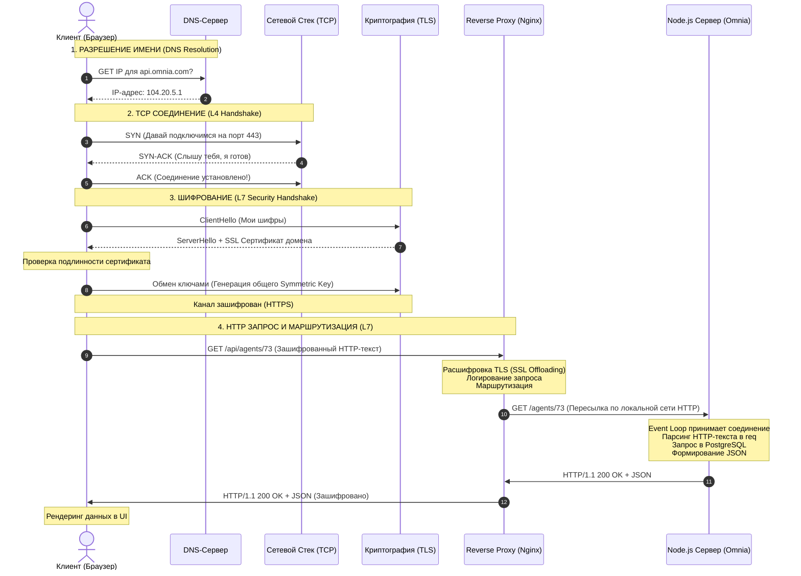

# Схема пути HTTP-запроса от браузера до сервера

Этот документ визуализирует и детально описывает каждый шаг, который проходит HTTP-запрос при обращении к серверу (на примере API Omnia: `https://api.omnia.com/agents/73`).

---

## 1. Диаграмма взаимодействия (Mermaid)

---

## 2. Подробный разбор каждого шага

### Шаг 1: Разрешение доменного имени (DNS Resolution)
Компьютеры в сети общаются по IP-адресам, а не по именам.
1. Браузер проверяет локальный кэш (не запрашивали ли `api.omnia.com` недавно).
2. Проверяет системный файл `hosts`.
3. Если адреса нет, отправляет UDP-запрос провайдеру интернета (ISP DNS).
4. Если DNS-сервер провайдера не знает IP, он идет выше по цепочке (Root DNS -> TLD DNS `.com` -> Authoritative Name Servers для `omnia.com`).
5. Браузер получает IP-адрес (например, `104.20.5.1`). Время выполнения: **10–100 мс**.

### Шаг 2: Установка TCP-соединения (L4 - 3-Way Handshake)
Перед отправкой HTTP-содержимого нужно гарантировать стабильный канал связи.
1. **SYN (Synchronize):** Клиент отправляет пакет с флагом SYN на порт 443 (HTTPS) сервера, заявляя о желании начать сессию.
2. **SYN-ACK (Synchronize-Acknowledge):** Сервер отвечает пакетом с флагами SYN и ACK, подтверждая прием запроса и готовность со своей стороны.
3. **ACK (Acknowledge):** Клиент подтверждает установку соединения. Канал готов к передаче байтов.
*Занимает ровно 1 RTT (Round Trip Time — время туда и обратно).*

### Шаг 3: Рукопожатие TLS (TLS Handshake - Безопасность)
TCP соединяет устройства, но данные идут в открытом виде. TLS строит зашифрованный туннель.
1. **ClientHello:** Клиент присылает поддерживаемые им версии TLS и алгоритмы шифрования (Cipher Suites).
2. **ServerHello + Certificate:** Сервер выбирает метод шифрования и присылает свой публичный SSL/TLS сертификат.
3. **Проверка:** Браузер проверяет, что сертификат выдан доверенным центром (например, Let's Encrypt), не истек и принадлежит домену `omnia.com`.
4. **Генерация ключей:** Стороны с помощью асимметричного шифрования (публичный/приватный ключ) обмениваются общим секретным сессионным ключом.
5. Дальнейший обмен идет с использованием симметричного шифрования этим общим ключом (это работает намного быстрее).
*Занимает еще 1–2 RTT.*

### Шаг 4: Отправка HTTP-запроса и Проксирование (Reverse Proxy)
1. Браузер формирует HTTP-текст (метод `GET`, заголовки, куки), шифрует его сессионным ключом TLS и отправляет по TCP-соединению.
2. Первым запрос встречает **Reverse Proxy** (обычно Nginx, HAProxy или Cloudflare).
3. Nginx занимается **SSL Offloading** — он расшифровывает запрос сам, чтобы не нагружать этой задачей Node.js.
4. Nginx проверяет базовую безопасность (Rate Limits, размер тела запроса), логирует факт запроса и пересылает его по быстрой локальной сети (localhost) на порт Node.js приложения (например, `:3000`).

### Шаг 5: Обработка в Node.js и HTTP-ответ
1. Наш Node.js сервер видит новое TCP-соединение через `net.createServer()` или `http.createServer()`.
2. Event Loop обрабатывает системные прерывания. Парсер переводит входящий текст в объекты `req` и `res`.
3. Код Omnia выполняет бизнес-логику: проверяет авторизацию (JWT), делает запрос в базу данных PostgreSQL.
4. Сервер сериализует ответ в JSON, формирует заголовки (включая `Content-Length` и `X-Request-Id`) и пишет текстовый HTTP-ответ обратно в сокет.
5. Nginx зашифровывает ответ обратно в TLS и отправляет его по сети клиенту.
6. Браузер расшифровывает JSON, передает его в твой React/Next.js-код, и UI обновляется.
